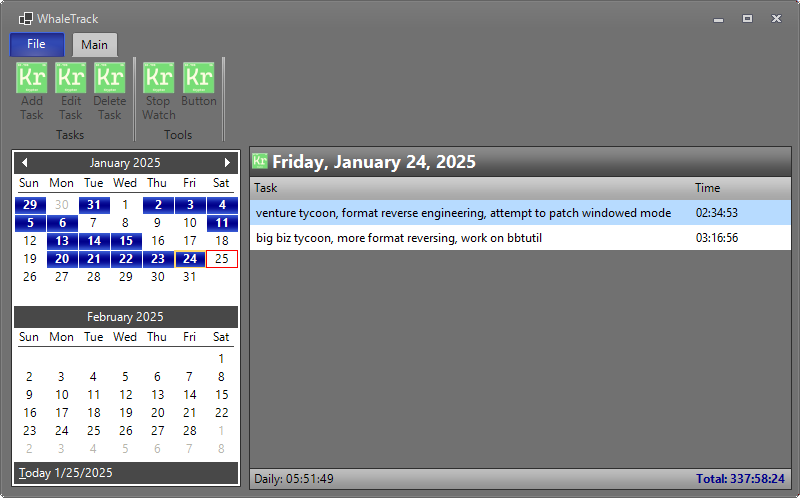

# WhaleTrack

I wrote this simple task tracker for myself to help remind myself that I actually do things every day.
It's mostly intended for my use only, but I figured since it helps me, it might also help other people.

**WhaleTrack remains in active development, as I constantly find things I want to change or add in the
process of using it.** ***Everything is more or less incomplete.***

## Screenshots

## Backup

WhaleTrack stores your task database in a SQLite database next to the application called `whaletrack.db`.
To back up your tasks, simply make a backup of this file! Quite simple.

## Contributions

As this is a project that I made for myself, I don't expect anyone to contribute to this, but if you would like to,
issues and pull requests are welcome!